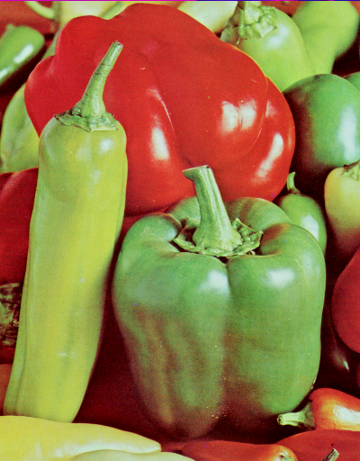
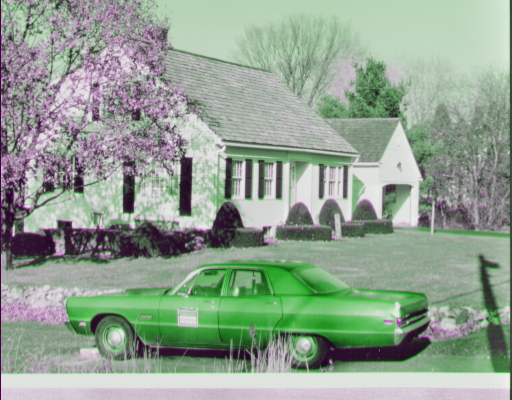
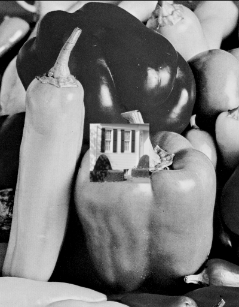
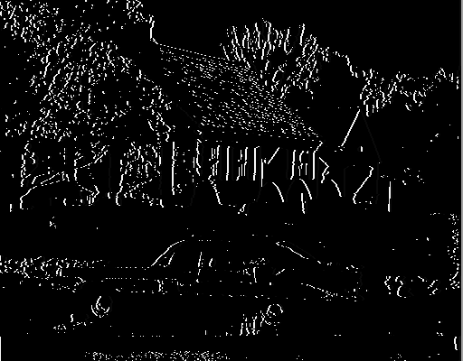
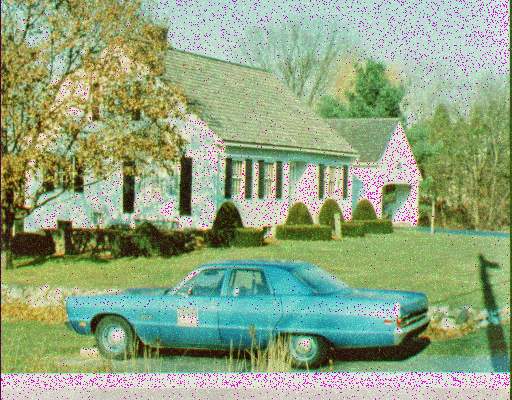

# Problem Set 0: Images as Functions

### 1. Input Images: img1, img2  
  
  

### 2. Color Planes  
  a) img1\_swapped: img1 with swapped red and blue channels  
  b) img1\_green: monochrome img1 using the green channel  
  c) img1\_red: monochrome img1 using the red channel  
  e) img1\_green > img1\_red  
  
  
  

  The green channel looks more like what you’d expect a monochrome image to
  look like beacause the human eye has increased sensitivity towards the green
  color spectrum.

### 3. Replacement of Pixels  
  Replacement of a 100x100 square region of img2 with the respective region
  of img1, using the monochrome versions of img1 and img2  
    
  
### 4. Arithmetic and Geometric Operations
  a) img1\_green: min = 0, max = 242, mean = 160.83, std=50.21  
  b) (img1\_green - mean) /std * 10 + mean  
  c) img1\_green\_shifted: Shifted img1\_green by 2 pixels to the left  
  d) Difference of img1\_green\_shifted from img1\_green  
  
  
  

### 5. Noise
  a) Application of gaussian noise (0,30) on the green channel of img1  
  b) Application of gaussian noise (0,30) on the blue channel of img1  
  c) The image with the gaussian noise in the blue channel looks cleaner than the
  one in the green channel, since the human eye has increased sensitivity towards
  the green color spectrum and thus can more easily distinguish the green noise.  
  
  