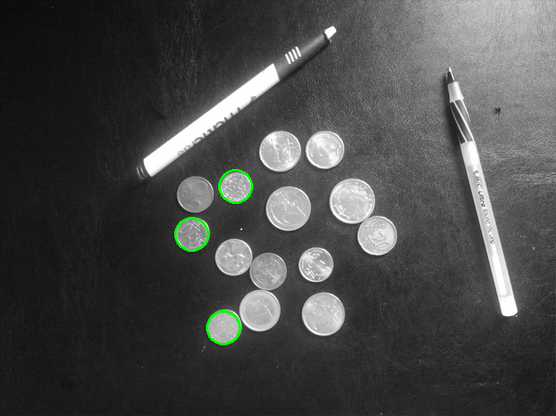

# Problem Set 1: Edges and Lines

### 1. Edge image
a0) Input image - a1) Edge image  

### 2. Linear Hough Transform
a) Hough Accumulator - b) Hough Peaks - c) Hough lines  

### 3. Linear Hough Transform on Noisy Image
a0) Input image with noise - a1) Smoothed image - b1) Edge image from original - b2) Edge image from smoothed  

  
c1) Hough Peaks - c2) Original image with Hough Lines  

### 4. Linear Hough Transform on Complex Image
a0) Input image - a1) Smoothed image - b1) Edge image  

  
c1) Hough Peaks - c2) Original image with Hough Lines

### 5. Circular Hough Transform
a0) Input image - a1) Smoothed image - a2) Edge image  

  
a3) Original Image with Hough Circles of known radius (r=20 px) - b1) Original Image with Hough Circles of unknown radius (r=[20, 50] px)

  

### 6. Linear Hough Transform on Cluttered Image
a0) Input image - a1) Smoothed image with Hough lines - c1) Smoothed image with constrained Hough Lines

  
c) constraint: parallel lines, in a distance smaller than a given threshold (rho_max)

### 7. Circular Hough Transform on Cluttered Image
a0) Input image - a1) Smoothed image with Hough Circles of unknown radius (r=[20, 40] px)

### 8. Linear Hough Transform on Distorted Image
a0) Input image - a1) Smoothed image with Hough Lines

  
b) An Elliptical Hough Transform must be applied in order
to detect circles (ellipses) on distorted images.

