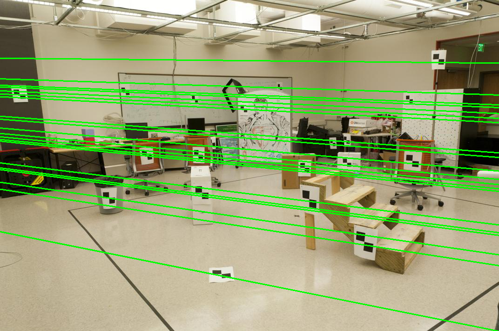
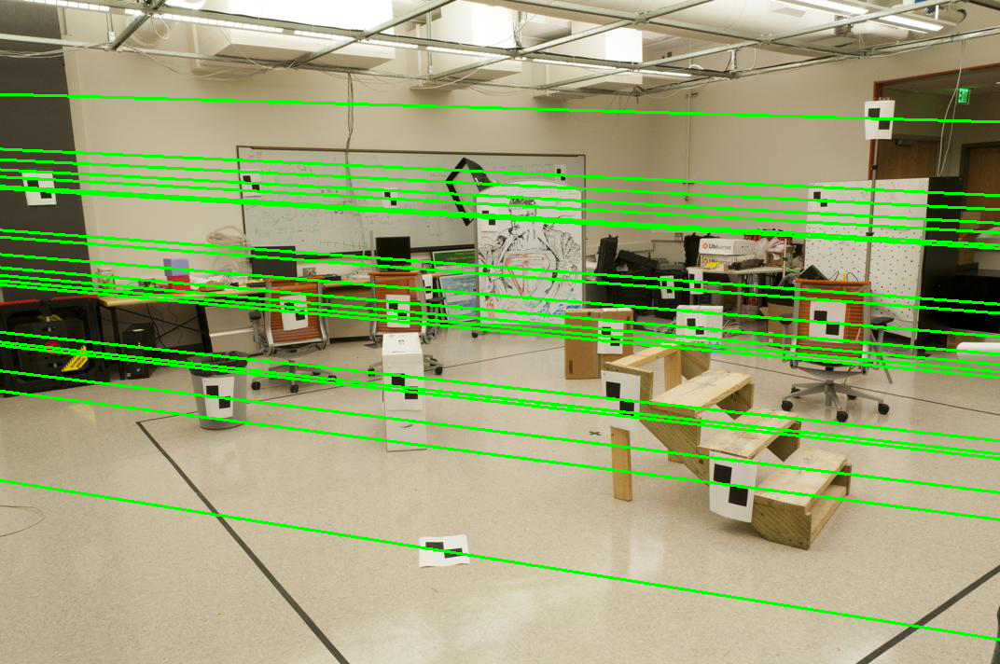
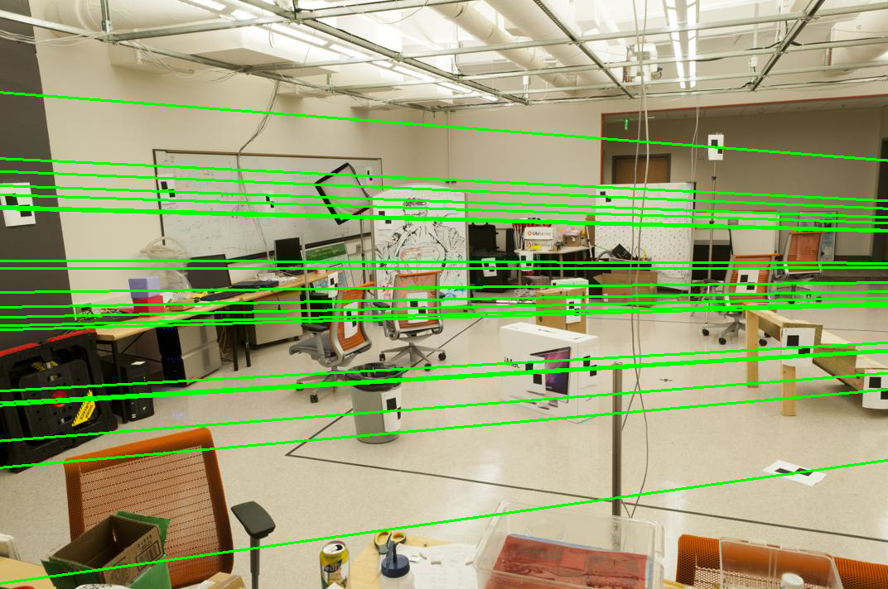

# Problem Set 3: Geometry

### 1. Calibration
a) Projection matrix:  
```
M = [[ 0.76785834 -0.49384797 -0.02339781  0.00674445]
     [-0.0852134  -0.09146818 -0.90652332 -0.08775678]
     [ 0.18265016  0.29882917 -0.07419242  1.        ]]
     
3D point [1.2323 1.4421 0.4506] projected to [ 0.14190586 -0.45183985]

Residual: 0.0016
```  

b) Projection matrix estimation using 8, 12 and 16 [3d, 2d] pairs:  
```
Best M = [[-2.04785625e+00  1.18569189e+00  4.12295509e-01  2.43947598e+02]
         [-4.53919622e-01 -3.02538918e-01  2.14961233e+00  1.65096749e+02]
         [-2.24168262e-03 -1.10021965e-03  5.71417125e-04  1.00000000e+00]]
         
Residual val for best M: 1.4230
```
 
c) Location of the camera in 3D world coordinates:  
```
C = [303.09777053 307.19723727  30.42713161]
```


### 2. Fundamental Matrix Estimation
a) Fundamental Matrix:  
```
F = [[-6.60675944e-07  7.90642197e-06 -1.88480992e-03]
     [ 8.82674944e-06  1.21863596e-06  1.72276843e-02]
     [-9.08539064e-04 -2.64201801e-02  1.00000000e+00]]
```

b) Fundamental Matrix with rank 2:
```
F = [[-5.35883058e-07  7.89972529e-06 -1.88480998e-03]
     [ 8.83820595e-06  1.21802118e-06  1.72276843e-02]
     [-9.08539027e-04 -2.64201801e-02  1.00000000e+00]]
```  

c) Epipolar lines estimation:  

   

d) F Improvement using the normalization matrices Ta and Tb:
```
T_a = [[ 0.00536182  0.         -2.99699089]
       [ 0.          0.00536182 -1.74580953]
       [ 0.          0.          1.        ]]

T_b = [[ 0.00506058  0.         -3.1208599 ]
       [ 0.          0.00506058 -1.75551532]
       [ 0.          0.          1.        ]]

F_hat = [[  0.27043812  -3.55869221  -0.58936831]
         [ -2.23376099   0.6805994  -43.3214581 ]
         [ -3.19379291  38.47553288   0.99972219]]
```  

e) Improved Fundamental Matrix and Epipolar Lines using normalization:  
```
New F = [[ 7.33805044e-06 -9.65613247e-05  2.43562183e-02]
         [-6.06107264e-05  1.84673403e-05 -1.91366320e-01]
         [-6.24066565e-04  2.59442041e-01 -5.23496483e+00]]
```  
   
