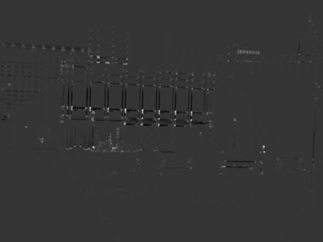
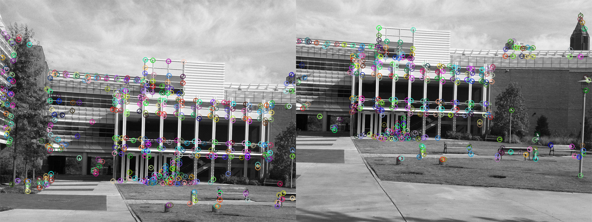

# Problem Set 4: Harris Corners, SIFT & RANSAC

### 1. Harris Corners

##### a) X and Y gradients 
transA gradient-pair image:  

  
simA  gradient-pair image:  

  

##### b) Harris Values
Input images simA, simB, transA, transB:  


Corresponding Harris Value images:  




##### c) Harris Corners
Images with Harris Corners marked:  


### 2. SIFT Features

##### a) Interest Points on trans and sim image pairs



##### b) Putative pair images for the trans and sim image pairs


###  3. RANSAC
##### a) Largest consensus set drawn on the trans image pair

```
Translation vector: [-127.  -74.]
Percentage of matches in the biggest consensus set: 4.48
```

##### b) Largest consensus set drawn on the sim image pair using similarity transform comparison

```
Transform matrix: [[  0.95539488  -0.27397108  41.49677419]
                   [  0.27397108   0.95539488 -50.81290323]]
Percentage of matches in the biggest consensus set: 43.90
```

##### c) Largest consensus set drawn on the sim image pair using Affine transform comparison

```
Transform matrix: [[  0.97523671  -0.20320466  22.5826657 ]
                   [  0.29133285   0.97887837 -62.79606701]]
Percentage of matches in the biggest consensus set: 35.77
```

##### d) Backwards warping and blending of the 2nd image to the 1st based on the similarity consensus set
Warped simB image:  
  
The simA - warped_simB overlay image:


##### e) Backwards warping and blending of the 2nd image to the 1st based on the Affine consensus set
Warped simB image:  

The simA - warped_simB overlay image:  


