# Problem Set 5: Optic Flow

### 1. Lucas Kanade Optic Flow

##### a) X,Y displacement images between Shift0 and ShiftR2, and Shift0 and ShiftR5U5 respectively (in TestSeq)
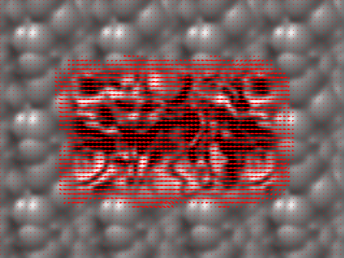 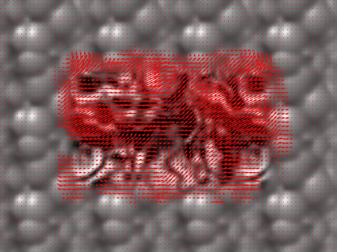

##### b) X,Y displacement images between Shift0 and ShiftR10/ShiftR20/ShiftR40 (in TestSeq)
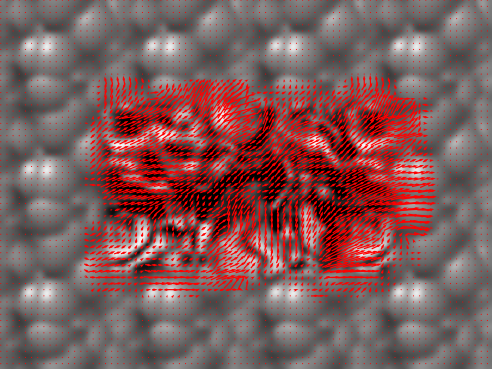 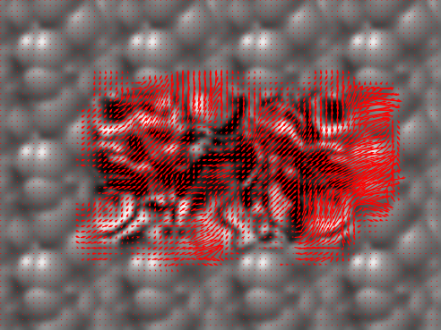 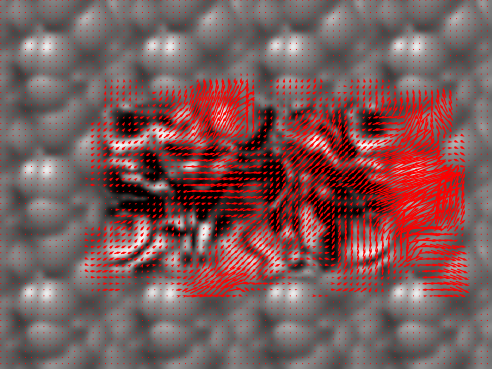

### 2. Guassian and Laplacian Pyramids

##### a) Gaussian Pyramid of the first image of DataSeq1
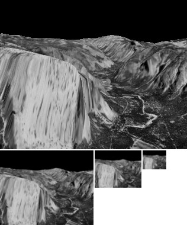

##### b) Laplacian Pyramid of the first image of DataSeq1
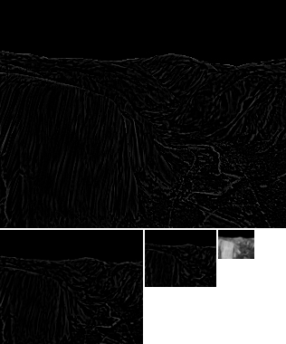

### 3. Warping by Flow

##### Single Level Lucas-Kanade application on DataSeq1 and Backwarping
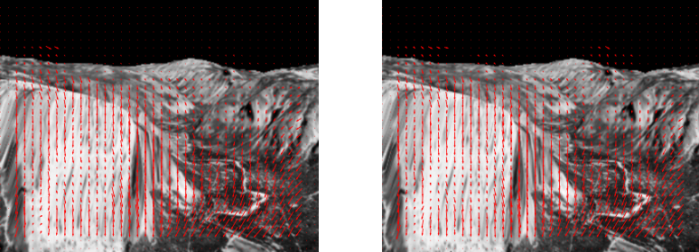 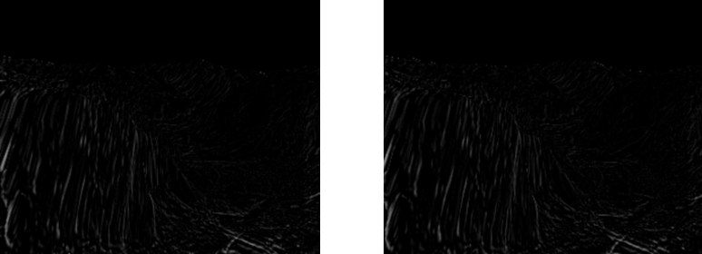

##### Single Level Lucas-Kanade application on DataSeq2 and Backwarping
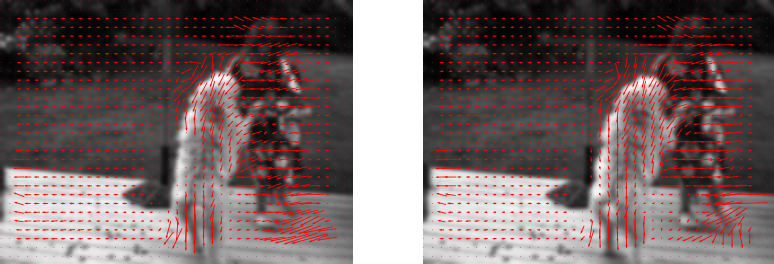 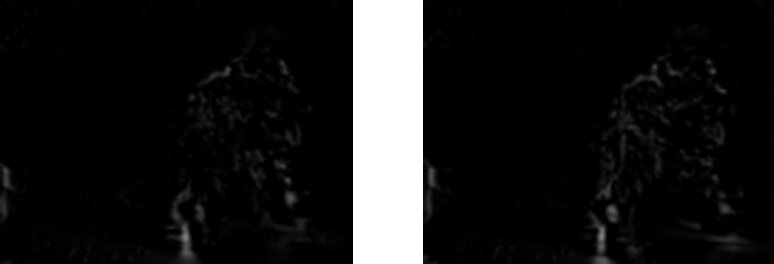

### 4. Hierarchical LK optic flow

##### Displacement images and difference images for TestSeq
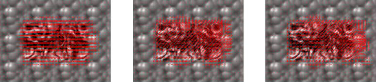 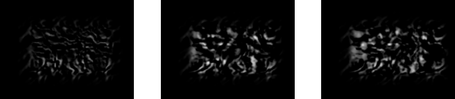

##### Displacement images and difference images for DataSeq1
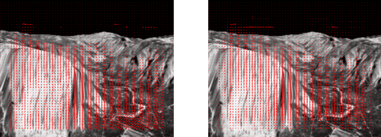 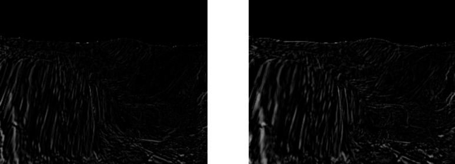

##### Displacement images and difference images for DataSeq2
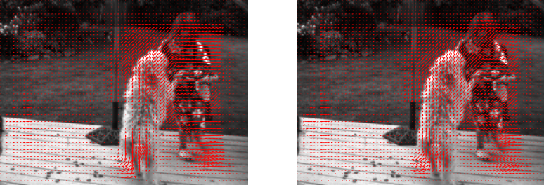 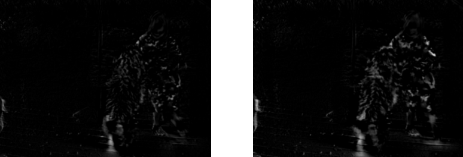

### 5. Hierarchical LK optic flow on the Juggle sequence

##### Displacement images and difference images for Juggle
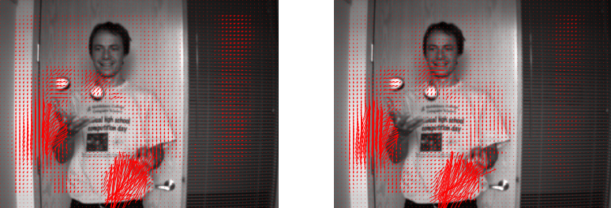 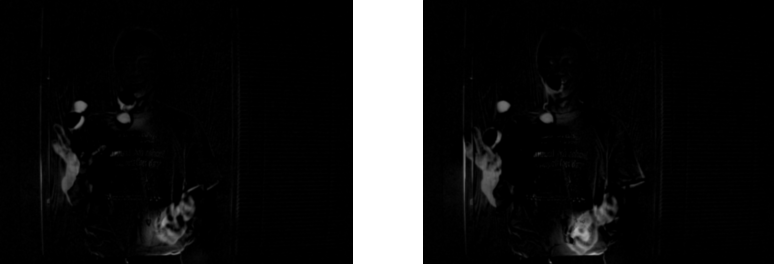
