# Problem Set 6: Particle Tracking

### 1. Particle Filter Tracking
##### a) Tracking Romney's face in pres\_debate.avi 
The image patch used for tracking:  
  
Image frames 28, 84 and 144 with overlaid visualizations:  
  

##### e) Tracking Romney's face in noisy\_debate.avi 
Image frames 14, 32 and 46 with overlaid visualizations:  
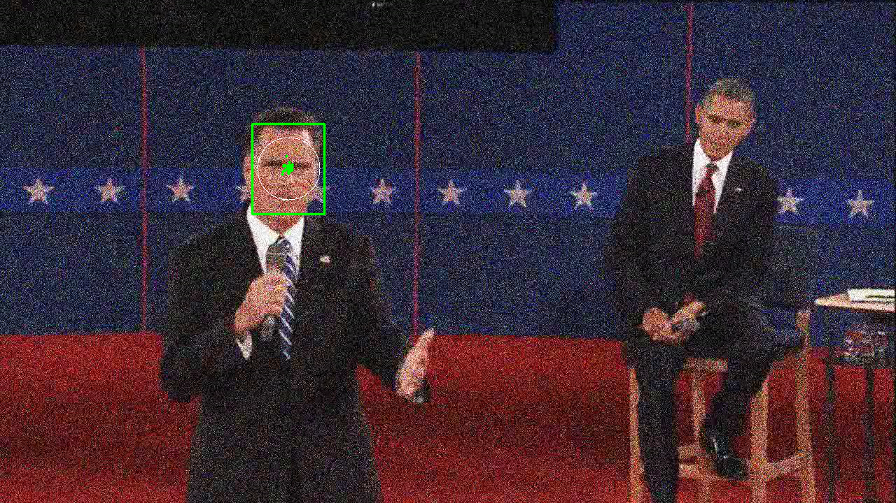 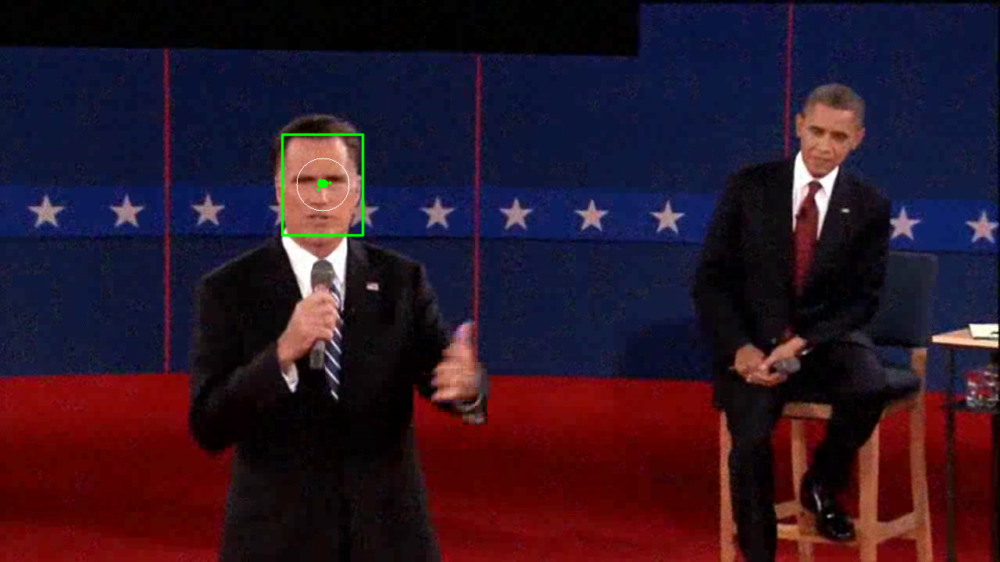 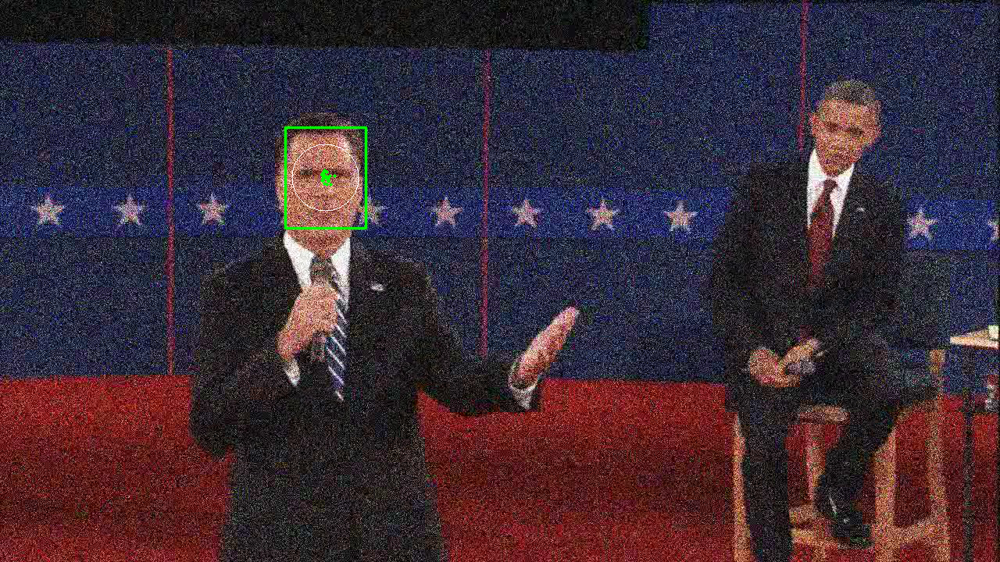

### 2. Appearance Model Update
##### a) Tracking Romney's left hand 
The image patch used for tracking:  
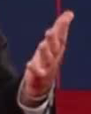  
Image frames 15, 50 and 140 with overlaid visualizations:  
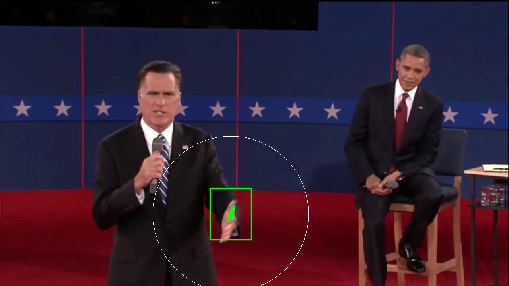 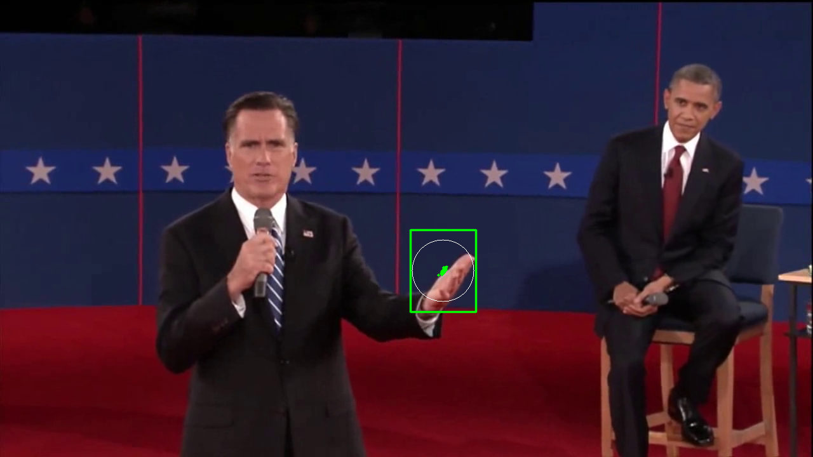 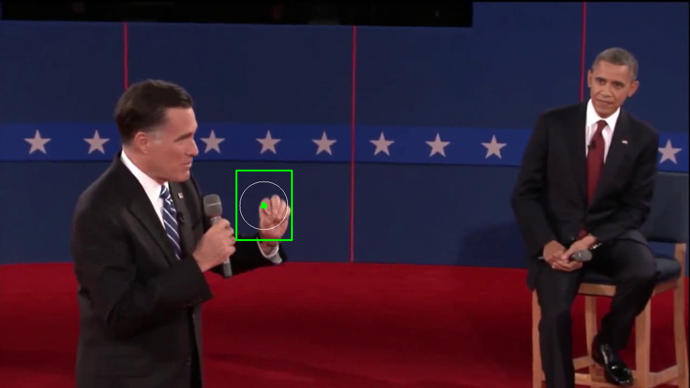

##### b) Tracking Romney's left hand on noisy video 
The image patch used for tracking:  
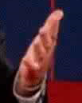  
Image frames 15, 50 and 140 with overlaid visualizations:  
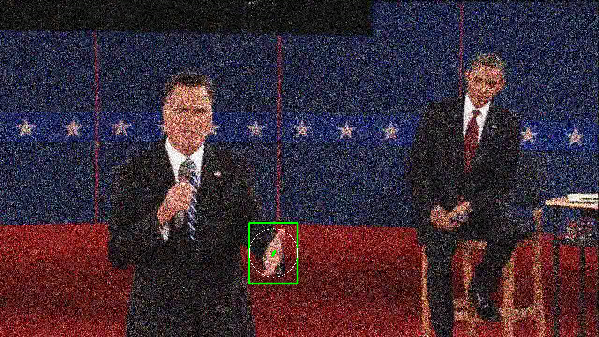 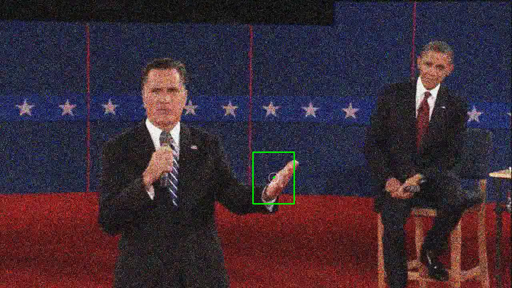 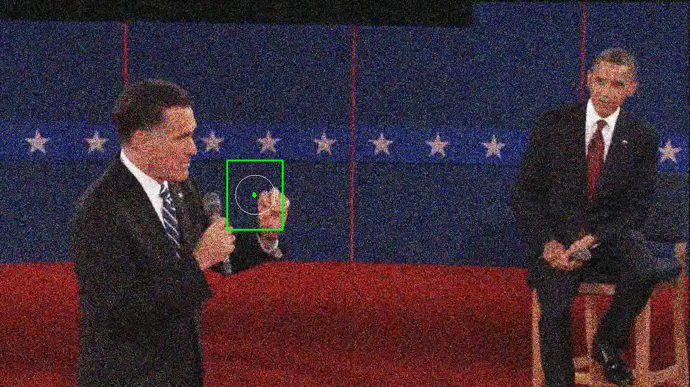

### 3. Mean-Shift Lite
##### a) Tracking Romney's in pres\_debate.avi 
The image patch used for tracking:  
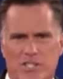  
Image frames 28, 84 and 144 with overlaid visualizations:  
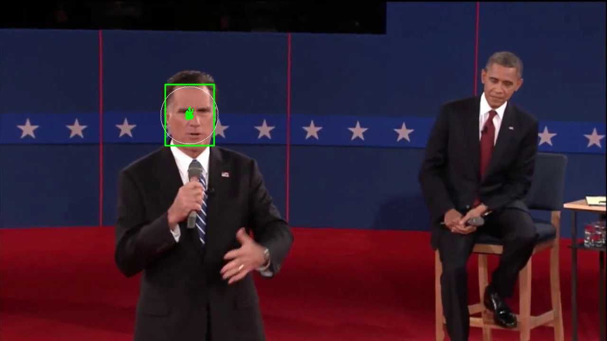 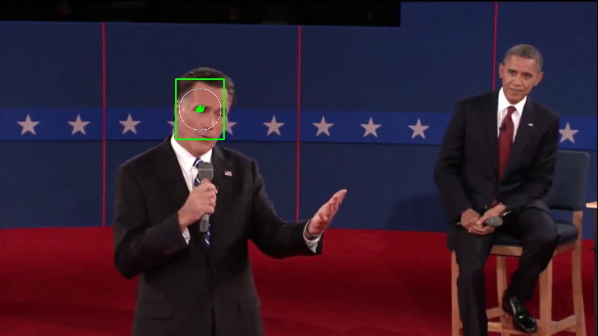 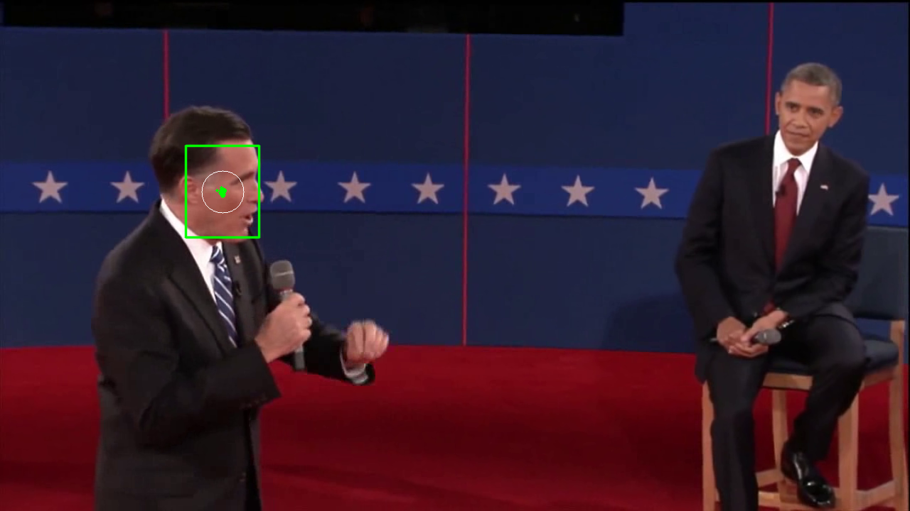
